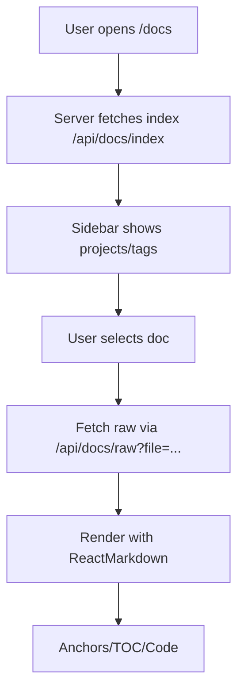

# Docs Hub Architecture

This module provides an enterprise-grade documentation hub that indexes markdown content under `docs/**` and `app/**/docs/**`, and renders it with search, filters, and deep links.

## Flowchart

## Indexing

- Fast-glob scans markdown files.
- `gray-matter` parses frontmatter.
- Headings extracted from content for TOC and anchors.
- Project is derived from path (`docs/<project>/...` or `app/<project>/docs/...`).

## Rendering

- `react-markdown` with GFM, `rehype-slug`, and autolinked headings.
- Tables are wrapped for horizontal scroll; code blocks are bordered.

## Re-indexing

Use the Re-index button in the hub or call `POST /api/docs/reindex`.

## Error Handling

- Server logs use `lib/logger.ts` with JSON logs in production.
- API responses are wrapped with `{ ok, data | error }`.
- Client toasts via `sonner` and defensive fallbacks to static messages.

