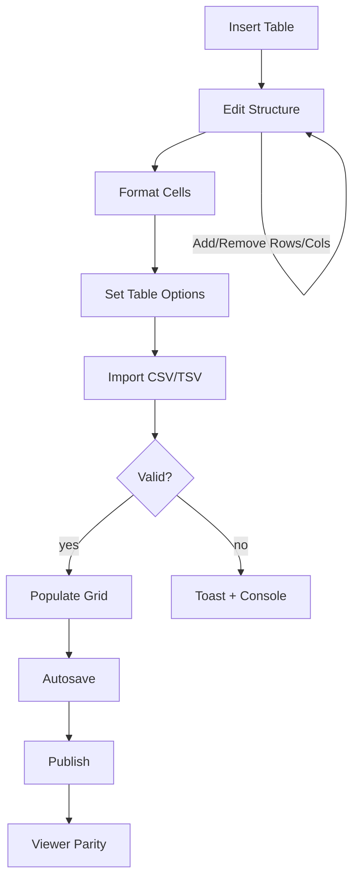

# Tables Module

Excel-like table authoring with robust UX, CSV import/export, and viewer parity.

## Quick Start

1. Insert a table from the Toolbar (defaults to 3×3 with header row).
2. Select any cell to open the Table Inspector in the right panel.
3. Adjust table options (sticky header, zebra, compact, caption, width, align).
4. Format cells (background, text/vertical align, padding, borders).
5. Import CSV/TSV via the Inspector (paste). Export CSV any time.

## Flow – Authoring & Data

## Attributes

- Table (`lib/TableExtended.ts`): `stickyHeader`, `stickyFirstColumn`, `zebra`, `compact`, `overflowX`, `caption`, `align`, `width`, `borderStyle`.
- Cell (`lib/TableCellExtended.ts`): `backgroundColor`, `textAlign`, `verticalAlign`, `padding`, `borderColor`, `borderWidth`.

## CSV/TSV

- Parser/serializer in `lib/csv.ts` handles quotes, embedded separators, newlines.
- Import replaces the current table selection with normalized content.
- Export walks the node to generate CSV for the current table.

## Diagnostics

- All actions are wrapped in try/catch with `console.info/error` context.
- Non-blocking toasts inform import/export success or failure.

## Roadmap (Excel-like)

- Multi-cell selection highlighting, keyboard navigation, copy/paste ranges.
- Fill down/right, column operations, sort, basic numeric formats.
- Optional formulas with A1 references and safe evaluation.

