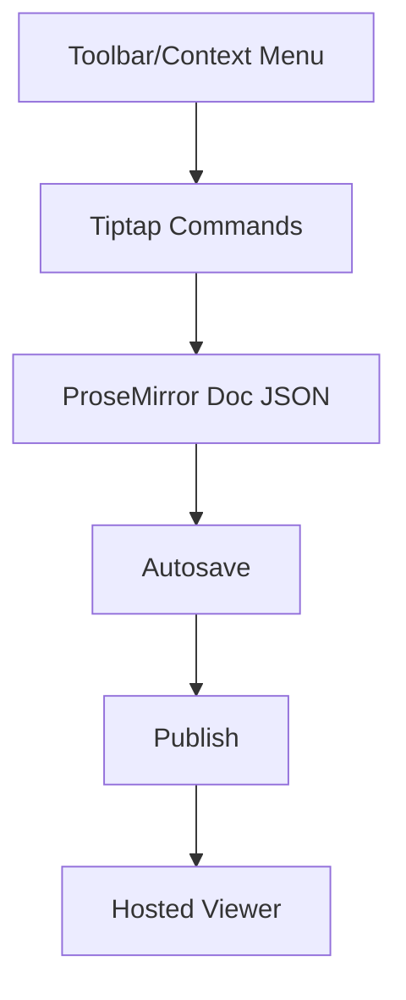

# Typography Module

Enterprise-grade text management for the editor and hosted pages with full WYSIWYG parity.

## Quick Start

1. Use the Toolbar to set Block type (Paragraph/H1–H6), Font family, Font size, Alignment, Underline, Colors, Task List, Indent/Outdent.
2. Use the Context Menu (right click) for quick heading/align/font-size/color/highlight and indent/outdent.
3. Clear formatting with the eraser icon if pasted text carries unwanted styles.

## Features

- Headings H1–H6, Paragraph; presets via block dropdown
- Font family: System, Inter (Sans), Georgia (Serif), Monospace
- Font size scale: 12–48px + context menu presets
- Line-height & letter-spacing via TextStyle mark (stored as attrs)
- Marks: bold, italic, strike, underline, code, link, subscript, superscript, color, highlight
- Alignment: left, center, right, justify (paragraph/heading attrs)
- Lists: bullet, ordered, task list (checkboxes); Indent/Outdent (sink/lift list item)
- Paragraph indent and spacing (before/after) via `ParagraphExtended`
- Clear formatting command

## Data Model

- Marks
  - textStyle: { fontSize?, lineHeight?, letterSpacing? }
  - color: { color }
  - highlight: { color }
  - fontFamily: { fontFamily }
  - underline | subscript | superscript: boolean
- Nodes
  - paragraph: { textAlign, indent, spacingBefore, spacingAfter }
  - heading: { textAlign }
  - taskList/taskItem: standard Tiptap attrs (taskItem.checked)

## Flow



## Viewer Parity

- Renders underline, color, highlight, fontFamily, sub/sup, textStyle (fontSize/lineHeight/letterSpacing)
- Respects textAlign on paragraphs/headings, paragraph `indent` (24px step), `spacingBefore`, `spacingAfter`
- Renders taskList/taskItem with checkboxes

## Tokens (globals)

- Font families: `--font-family-sans`, `--font-family-serif`, `--font-family-mono`
- Sizes: `--font-size-xs`..`--font-size-3xl`
- Line-heights: `--leading-tight|normal|relaxed|loose`
- Letter-spacing: `--tracking-*`

## Diagnostics

- All toolbar/context actions wrapped in try/catch with console.info/error
- Paste sanitization for Word/HTML: strips styles/classes/scripts; preserves safe tags and links
- Safe fallbacks for invalid values

## Flow – Paste Sanitization

```mermaid
flowchart TD
  P[Paste event] --> C{Inside table?}
  C -- yes --> T[Parse CSV/TSV]\nReplace table selection
  C -- no --> W{Word/HTML?}
  W -- yes --> S[Sanitize HTML]\nKeep safe tags\nInsert content
  W -- no --> D[Default Tiptap handling]
```

## Roadmap

- Saved typography presets per document
- Themeable color palettes & tokens

